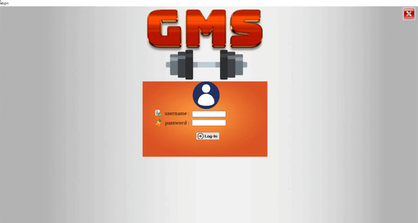

# Gym Management System
Software written in C#

                                                 Project completed during September 2020.
                                                        Uploaded on September 5.

GMS (Gym Management System) is a record management software designed for use by a gym's authorized staff members.
It contains an authentication system that prompts the user for the username and password. In case one of the two
credentials are invalid, the user will be notified.

Following a successful log-in, the user is presented with the Main Menu, which contains several features. Some of them include adding
new members and equipment, or registering staff. Also, the user can access the existing data from the database, as well as modify it according to their needs.

-----------------------------
Petar Bulatovic

[Video Demo](https://youtu.be/td67CS4sg_4) 
